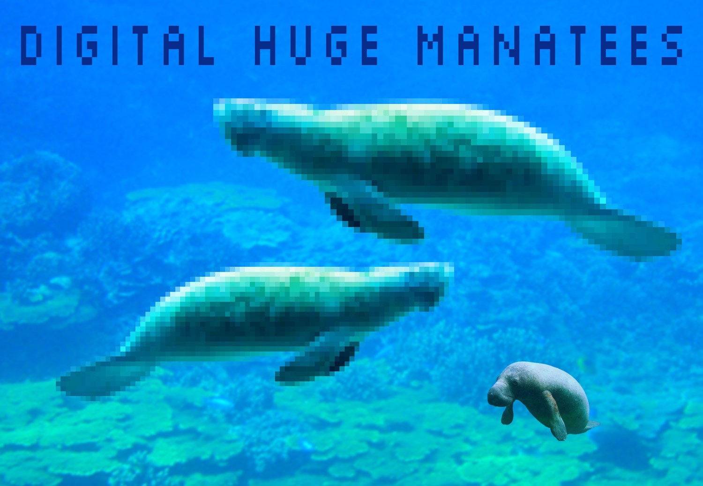

# IASC 2P02 | Alex Christie

## About me

I am an Assistant Professor in Digital Prototyping at Brock University’s Centre for Digital Humanities. I completed my doctorate at the University of Victoria, where I conducted research on 3D geospatial expression and scholarly communication for the Modernist Versions Project (MVP) and Implementing New Knowledge Environments (INKE) in the Electronic Textual Cultures Lab (ETCL) and the Maker Lab. I also developed an open source toolkit for digital humanities pedagogy with grant funding from the Association for Computers and the Humanities (ACH). I am currently working on a book-length history of the mechanical production and interpretation of texts before the advent of digital computing.

## Blog post

First sentence of blog post goes here... [continue reading](blog)
